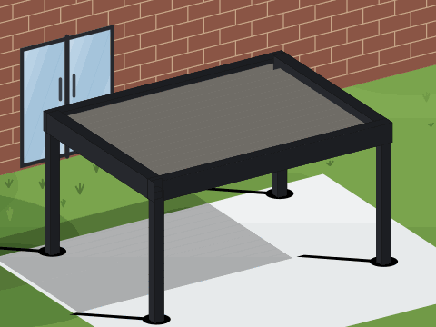

# Pergola Card

Custom card Lovelace per **pergole bioclimatiche**, con rendering 3D (SVG, nessuna dipendenza). Mostra la pergola in prospettiva con lame orientabili animate, luci LED, vetrate scorrevoli e ambiente (prato o muro). Un solo file, leggera.



> Sostituisci `images/preview.gif` con uno screenshot reale: e' richiesto per l'inclusione nello store predefinito di HACS.

## Funzioni

- Inclinazione lame animata (perno centrale), orizzontali o verticali.
- Lame fisse a intervalli regolari, con luci montate sotto (strip o faretti).
- Luci: colore caldo/freddo o RGB (colore dall'entita'), riflesso a terra.
- Vetrate scorrevoli (porte-finestre) su 4 lati (libera) o 3 (addossata).
- Ambiente: prato (libera) o muro di mattoni con porta-finestra (addossata), giorno/notte.

## Installazione via HACS

[](https://my.home-assistant.io/redirect/hacs_repository/?owner=Pocho1124&repository=pergola-card&category=plugin)

Come repository personalizzato:

1. HACS -> menu (tre puntini) -> Repository personalizzati.
2. URL: https://github.com/Pocho1124/pergola-card  - categoria: Dashboard.
3. Installa Pergola Card, poi ricarica le risorse o riavvia Home Assistant.

La risorsa viene registrata su /hacsfiles/pergola-card/pergola-card.js (Modulo JavaScript).

### Installazione manuale

Copia pergola-card.js in /config/www/ e aggiungi la risorsa /local/pergola-card.js come Modulo JavaScript.

## Configurazione

```yaml
type: custom:pergola-card
title: Pergola Terrazzo
tilt_entity: cover.pergola_lame       # inclinazione lame (obbligatoria)
led_entity: light.pergola_led         # luci (opzionale)
glass_entity: cover.pergola_vetrate   # vetrate scorrevoli (opzionale)
day_night: sun.sun                    # giorno/notte (opzionale)
mount: free                           # free | wall
louvers: horizontal                   # horizontal | vertical
slats: 14                             # numero totale di lame
fixed_every: 5                        # una lama fissa ogni N (0 = nessuna)
led_type: strip                       # strip | spot (faretti)
led_rgb: false                        # true = usa il colore dell'entita' RGB
led_temp: warm                        # warm | cool  (se non RGB)
led_color: "#ffdca6"                  # colore di default
glass: true                           # mostra le vetrate
controls: true                        # mostra i comandi in card
```

| Opzione | Tipo | Default | Descrizione |
|---|---|---|---|
| tilt_entity | string | - | Inclinazione lame. Obbligatoria. cover (tilt/position), number, input_number o sensor. |
| tilt_max | number | 100 | Valore che corrisponde al 100% (es. 90 se in gradi). |
| led_entity | string | - | Luci (light/switch/input_boolean). Abilita pulsante e colore RGB. |
| glass_entity | string | - | Vetrate scorrevoli (cover, position 0-100). Abilita lo slider vetrate. |
| day_night | string | - | sun.sun o sensore di luminosita' per giorno/notte automatico. |
| mount | string | free | free (prato, 4 lati) o wall (muro di mattoni, 3 lati). |
| louvers | string | horizontal | Orientamento lame: horizontal o vertical. |
| slats | number | 14 | Numero totale di lame. |
| fixed_every | number | 0 | Una lama fissa ogni N lame (le luci vanno sotto le fisse). |
| led_type | string | strip | strip (barra) o spot (mini faretti). |
| led_rgb | boolean | false | true: colore dall'attributo rgb_color dell'entita'. |
| led_temp | string | warm | warm o cool (usato se non RGB). |
| led_color | string | #ffdca6 | Colore di default della luce. |
| glass | boolean | false | Mostra le vetrate. |
| controls | boolean | false | Mostra slider inclinazione, pulsante luci e slider vetrate. |

## Licenza

MIT.
